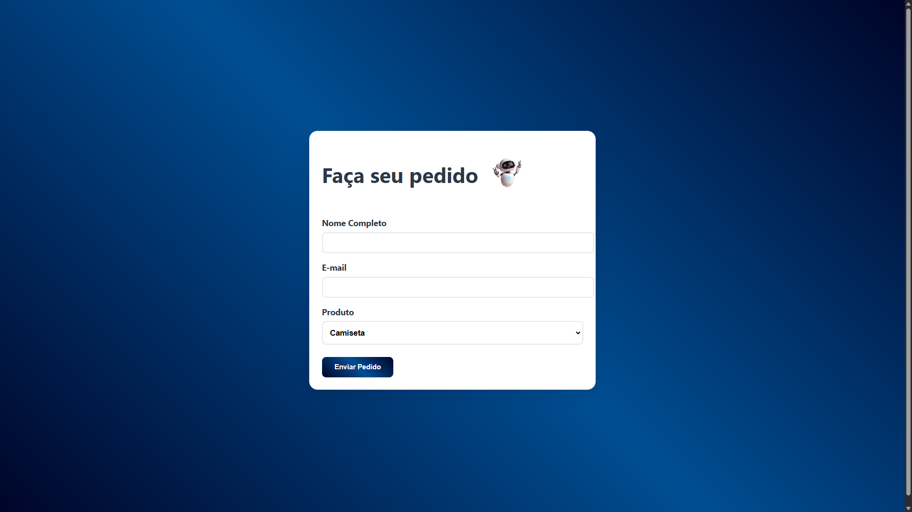
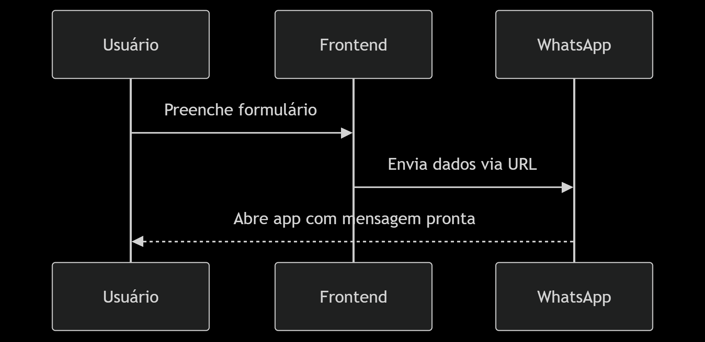

 <div align="center">

# FORMULÁRIO LOW CODE

🚀 Envie pedidos diretamente para meu WhatsApp com um formulário gerado automaticamente!

 <div align="center">


[](https://github.com/RaizerTechDev/lowcode-form/blob/master/Documentation.md)

[( Clique aqui para realizar seu `Pedido`)](https://task-flow-gerenciador-de-tarefas-frontend.vercel.app/)

<br>
  
 [Demonstração-Projeto-RaizerTech] 



<br>

---

<div align="left">

## 📑 Índice
- [FORMULÁRIO LOW CODE](#formulário-low-code)
  - [🎯Objetivo](#objetivo)
  - [🛠️ Tecnologias Utilizadas](#️-tecnologias-utilizadas)
  - [🛠️Configuração e Instalação dos Ambientes](#️configuração-e-instalação-dos-ambientes)
    - [Pré-requisitos](#pré-requisitos)
    - [Instale as dependências](#instale-as-dependências)
  - [🚀 Execução](#-execução)
    - [Passo a Passo](#passo-a-passo)
      - [1. Clone o repositório](#1-clone-o-repositório)
      - [2. Execute o servidor](#2-execute-o-servidor)
      - [3. Cria versão otimizada (se aplicável)](#3-cria-versão-otimizada-se-aplicável)
  - [Personalização](#personalização)
    - [1. form.js](#1-formjs)
    - [2. styles.css](#2-stylescss)
  - [Estrutura do Projeto](#estrutura-do-projeto)
  - [Fluxo de Funcionamento](#fluxo-de-funcionamento)
  - [Licença](#licença)
  - [👤 Autor](#-autor)

<br>

---

## 🎯Objetivo

Criar uma solução Low Code que:
✅ Gera formulários responsivos a partir de configuração JSON
✅ Envia dados diretamente para WhatsApp
✅ Permite customização visual sem alterar código
✅ Reduz tempo de desenvolvimento em 80% comparado a métodos tradicionais

<br>

---

## 🛠️ Tecnologias Utilizadas

<p align="left">
  
  
  
  
  
  
</p>
<br>

---

## 🛠️Configuração e Instalação dos Ambientes

### Pré-requisitos

- Node.js (v18+)
- NPM (v9+)

<br>

### Instale as dependências

```bash
npm install
```

<br>

---

## 🚀 Execução

### Passo a Passo

#### 1. Clone o repositório

```bash
git clone https://github.com/seu-usuario/lowcode-form.git
cd lowcode-form
```

<br>

#### 2. Execute o servidor

```bash
npm start
```

- Portas:
- http://localhost:3000

<br>

#### 3. Cria versão otimizada (se aplicável)

```bash
npm run build
```

<br>

---

## Personalização

### 1. form.js

- Adicionar/Remover Campos

```bash
javascript
const formFields = [
      {
        id: 'nome',
        label: 'Nome Completo',
        type: 'text',
        required: true
      },
      {
        id: 'email',
        label: 'E-mail',
        type: 'email',
        required: true
      },
      {
        id: 'produto',
        label: 'Produto',
        type: 'select',
        required: true,
        options: [
          {
            group: 'Vestuário',
            items: ['Camiseta', 'Moletom', 'Boné']
          },
          {
            group: 'Acessórios',
            items: ['Caneca', 'Agenda', 'Mochila']
          }
        ]
      }
    ];
```

- Alterar Destino do WhatsApp

```bash
javascript
window.location.href = `https://wa.me/SEU_NUMERO_AQUI?text=${mensagemCodificada}`;
```

### 2. styles.css

- Exemplo: Mudar gradiente do botão

```bash
css
button[type="submit"] {
 background: linear-gradient(135deg, #ff9a9e 0%, #fad0c4 100%);
}
```

- Exemplo: Alterar fonte

```bash
body {
 font-family: 'Poppins', sans-serif;
}
```

<br>

---

## Estrutura do Projeto

```text
lowcode-form/
├── public/ # Arquivos acessíveis publicamente
│ ├── styles.css # Estilos personalizados
│ └── form.js # Lógica do formulário
├── src/
│ ├── views/
│ │ └── index.ejs # Template principal
│ └── server.js # Configuração do servidor
├── .gitignore # Arquivos ignorados pelo Git
└── package.json # Dependências e scripts
```

## Fluxo de Funcionamento

- Diagrama
  

<br>

- Código

  ```text
  Sequência Diagrama

    Usuário->>Frontend: Preenche formulário
    Frontend->>WhatsApp: Envia dados via URL
    WhatsApp-->>Usuário: Abre app com mensagem pronta
  ```

  <br>

---

## Licença

Este projeto está sob licença MIT - veja o arquivo LICENSE para detalhes.

<br>

---

## 👤 Autor

<p>
    
    <p>&nbsp&nbsp&nbspRafaRaizer-Dev<br>
    &nbsp&nbsp&nbsp<a href="https://api.whatsapp.com/send/?phone=47999327137">Whatsapp</a>&nbsp;|&nbsp;<a href="https://www.linkedin.com/in/rafael-raizer//">LinkedIn</a>&nbsp;|&nbsp;<a href="https://github.com/RaizerTechDev">GitHub</a>|&nbsp;<a href="https://public.tableau.com/app/profile/rafael.raizer">Tableau</a>|&nbsp;<a href="https://raizertechdev-portfolio.netlify.app/">Portfólio</a>&nbsp;</p>
</p>
